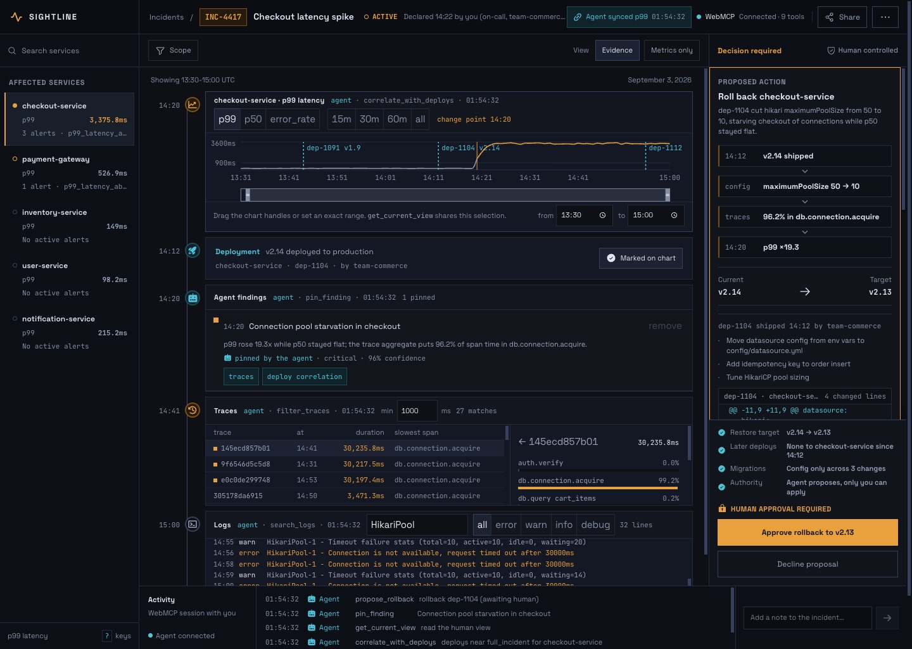
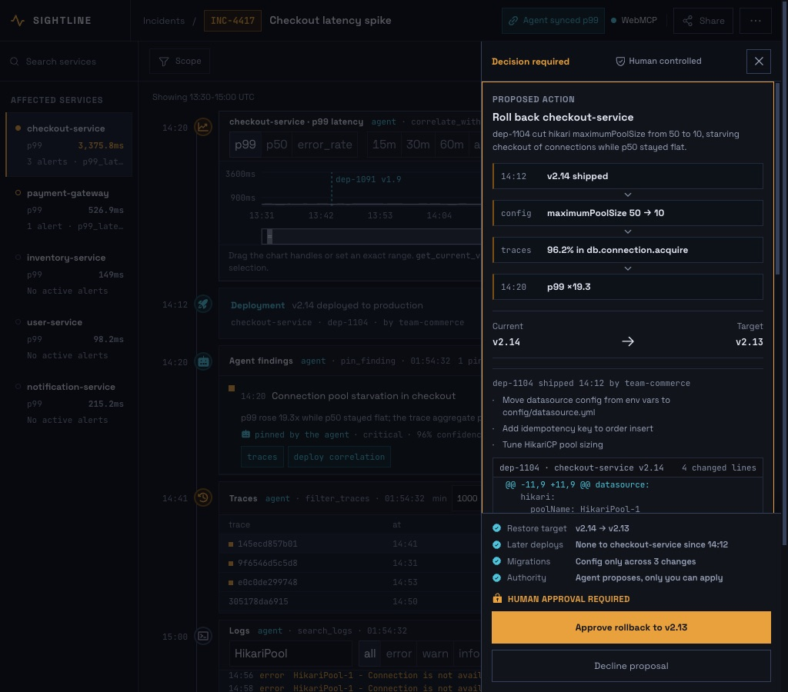

# Sightline

An incident war room a human and an AI agent investigate **together, on the same
screen**, over [WebMCP](https://github.com/webmachinelearning/webmcp).

**[Open the live demo](https://sightline-webmcp.netlify.app/)** ·
**[Browse the source](https://github.com/nozimjon-git/sightline-webmcp)**



There is no chat panel in this app. The agent is whatever WebMCP host you open
the page in — ChatGPT, or Chrome 149+ with the WebMCP origin trial. The page
registers nine tools; when the agent calls one, the console visibly changes, and
the agent can read back what the *human* is looking at and continue from there.

Prompt it with one sentence — **"Checkout p99 is spiking. Find out why."** — and
it should reach the deploy on its own.

---

## The incident

`checkout-service` p99 latency sits near 180ms, then jumps to
~3.4 seconds at **14:20** and stays there. Error rate goes 0.1% → 4.2%.

The board is deliberately noisy:

| Signal | What it is |
| --- | --- |
| `checkout-service` p99 19x, p50 1.25x | The tell. Latency is **queueing**, not compute. |
| `payment-gateway` p99 241ms → 520ms | Downstream victim, not a cause. |
| `inventory-service` bump at 13:45, resolves by 13:54 | Red herring, caused by a cache-TTL deploy. |
| `user-service v3.2` at 14:55 | A deploy, but 35 minutes *after* onset. |
| `notification-service` 0.31% errors, flat all day | Chronically noisy, perfectly stable. |

The path to the answer:

1. `checkout-service` is critical; three alerts firing.
2. p99 has a change point at 14:20 and a 19.3x change factor. p50 has **no**
   change point at all — so requests are waiting for something, not doing more work.
3. 96% of post-14:20 trace time sits in a single span: `db.connection.acquire`.
   `db.query` is unchanged.
4. The log stream repeats
   `HikariPool-1 - Connection is not available, request timed out after 30000ms`,
   first seen 14:20, 18 times.
5. `dep-1104` (`checkout-service v2.14`) shipped at **14:12**, eight minutes
   before onset, proximity score 0.73. Its deploy annotation reads:
   `hikari.maximumPoolSize 50 -> 10 (copied from the staging profile).`

**Root cause:** v2.14 shrank the connection pool from 50 to 10. Rolling back
`dep-1104` restores it, and the fixture contains the twenty minutes of recovery
telemetry that follow — revealed only once a human approves the rollback.

## The nine tools

Read tools return structured data *and* change the screen. Write tools change
durable incident state.

| Tool | What it does | What you see |
| --- | --- | --- |
| `get_service_health()` | Status, p50, p99, error rate and firing alerts for all five services. The entry point. | Flashes the service rail, selects the worst service |
| `query_metrics({service, metric, window})` | Baseline, peak, current value, anomaly/recovery onset, direction, factors, time-to-SLO and ≤15 samples. | Repaints the chart to that service/metric/window |
| `filter_traces({service, window, min_latency_ms?, limit?})` | Aggregate span breakdown across every match, plus the slowest exemplars. | Filters the trace table, opens the slowest trace |
| `search_logs({service, window, query?, level?, limit?})` | Log lines grouped into patterns with counts and first/last seen. | Filters the log pane |
| `correlate_with_deploys({window, service?})` | Every candidate deploy scored 0–1 on proximity to the anomaly, with its diff note. | Drops deploy markers on the chart |
| `pin_finding({title, evidence, timestamp, severity})` | Appends a finding to the shared incident timeline. | New entry in the right pane, attributed to the agent |
| `propose_rollback({deploy_id, reason})` | Returns `{ status: "awaiting_human_approval" }` and **changes nothing else**. | Confirmation card with Approve / Dismiss |
| `draft_incident_report()` | Assembles the pinned findings into a postmortem. Fails if nothing is pinned. | Structured report in the right pane |
| `get_current_view()` | What the human is looking at right now: selection, window, open trace, filters, findings, rollback state, their recent manual actions. | Flashes the handoff chip in the header |

`get_current_view` is the point of the whole submission. Drag the window handles
under the chart to 14:15–14:30, click a trace, then ask your agent "what am I
looking at?" — it picks up your investigation instead of restarting it.

## Why WebMCP rather than browser automation

The interface remains the source of truth for both participants. WebMCP gives
the agent typed, bounded operations over the same state a human manipulates,
without scraping pixels, guessing selectors, or hiding work in a parallel chat.

- Read tools select and annotate the visible investigation surface.
- Write tools create visible, attributed incident artifacts.
- `get_current_view` preserves human context across the handoff.
- `propose_rollback` can request a consequential action but cannot approve it.
- Tool errors return structured recovery guidance instead of disappearing into
  a rejected promise.

## Four properties worth checking in the source

**No tool answer is hard-coded.** Every number a tool returns is computed from
a deterministic synthetic fixture by real code in
[`src/lib/analysis.ts`](src/lib/analysis.ts) — median
baselines, a change-point detector, span aggregation, log pattern grouping,
deploy proximity scoring. If `query_metrics` says p99 peaked at 3498.6ms at
14:49, that is `Math.max` over the series. The fixture itself
([`src/data/incident.ts`](src/data/incident.ts)) is generated deterministically:
no `Math.random`, no `Date.now`, hash-based noise, so the same minute always
produces the same value.

**Tools are not a parallel code path.** There is one Zustand store. `filter_traces`
calls `setTraceFilter`; so does the input in the trace pane header. Every action
takes an `Actor`, which is how the interface can tell you who did what.

**The rollback gate is real.** `propose_rollback` writes a proposal and returns.
The only function that applies a rollback is `store.approveRollback`, and its
only caller is the `onClick` of the Approve button in
[`RollbackCard.tsx`](src/components/RollbackCard.tsx). No tool reaches it.
Requested windows are bounded by the current simulated time, so recovery data
is unavailable until that approval advances the incident clock.

**Errors teach the caller how to retry.** Not `"No results"` but
`"No traces for checkout-service at or above 3000ms in 13:30-14:00. The slowest
trace in that window is 197.9ms — lower min_latency_ms to 158 or below to see it."`
Note that tools never *reject*: the WebMCP spec discards a rejected execute
promise's reason, which would throw the hint away. They resolve with
`{ isError: true }` instead.

## WebMCP notes

Registration lives in [`src/lib/webmcp.ts`](src/lib/webmcp.ts). Two details that
are easy to get wrong:

- The current spec puts the imperative API on **`document.modelContext`**.
  Earlier drafts and some hosts use `navigator.modelContext`, and older ones a
  batch `provideContext({ tools })`. All three are probed, and the header says
  which one was found.
- `registerTool()` rejects with a `SecurityError` unless the document's agent
  cluster is **origin-keyed**. This app therefore sends
  `Origin-Agent-Cluster: ?1` in dev, preview and production
  ([`vite.config.ts`](vite.config.ts), [`public/_headers`](public/_headers),
  [`netlify.toml`](netlify.toml)). Sending `?0`, or nothing on a shared-origin
  host, silently disables WebMCP.

`Permissions-Policy: tools=(self)` is also sent; it matches the feature's
default allowlist and documents the intent.

## Running locally

```bash
npm install
npm run dev      # http://localhost:5173
```

No backend, no API keys, no `.env`. `npm run build` produces a static `dist/`.
Investigation state is saved in `sessionStorage`, so a refresh preserves the
handoff; **reset replay** starts the deterministic scenario over.

To see tools registered, open in Chrome 149+ with
`chrome://flags/#enable-webmcp-testing` enabled, or in a WebMCP-capable host such
as ChatGPT Desktop. The header badge reports which API surface was found and how
many tools registered.

### Verifying registration against Chrome's implementation

You can check the whole surface without an agent. Launch Chrome with the WebMCP
runtime feature on:

```bash
'/Applications/Google Chrome.app/Contents/MacOS/Google Chrome' \
  --enable-blink-features=WebMCP https://sightline-webmcp.netlify.app/
```

Then, in devtools:

```js
const tools = await document.modelContext.getTools();
tools.length                                  // 9
tools.map(t => t.name)

const qm = tools.find(t => t.name === 'query_metrics');
// Chrome's executeTool takes the arguments as a JSON *string*, not an object.
await document.modelContext.executeTool(qm, JSON.stringify({
  service: 'checkout-service', metric: 'p99', window: 'full_incident',
}));
```

Two things that are easy to miss and worth seeing for yourself: a tool error
comes back as `{ "isError": true, "content": [...] }` with the retry hint
intact rather than as a rejected promise, and `propose_rollback` returns
`awaiting_human_approval` while the page state stays untouched until someone
clicks Approve.

### Driving the tools without an agent

Every tool is on `window.sightline`, so you can exercise the whole thing from
devtools:

```js
await sightline.call('get_service_health')
await sightline.call('query_metrics', { service: 'checkout-service', metric: 'p99' })
await sightline.call('filter_traces', { service: 'checkout-service', window: '14:20-15:00', min_latency_ms: 1000 })
sightline.tools           // the nine descriptors, schemas included
```

`npm run dev` also serves **`/selftest.html`**, which walks the full
investigation, the error paths and the post-rollback state through the tool
layer and prints every request and response. It is a dev-only page and is not
part of the production build.

### Automated verification

```bash
npm test
npm run typecheck
npm run build
```

The regression suite covers the telemetry approval boundary, recovery
classification, malformed and oversized inputs, cancellation, synchronized
reports, and preserved decision timestamps.

## Keyboard

The console is driven from the home row, because every tool it sits next to is:

| | |
| --- | --- |
| `[` `]` | previous / next service |
| `1` `2` `3` | p99 · p50 · error rate |
| `w` | cycle the time window |
| `j` `k` | next / previous trace |
| `x` | close the open trace |
| `/` | search the log stream |
| `?` | the shortcut list |

Approving a rollback is deliberately **not** bound to a key. It is the one
irreversible action in the application, and it stays a click on a button that
only exists while a proposal is open — a stray keystroke should never be able to
ship a production change.

## Interface and accessibility

Every pane carries a provenance stamp in its header naming who last changed it
and how — `agent · filter_traces · 14:47:20`, or `you · window 14:00-14:30`.
When a tool mutates a pane, that pane gets one sharp flash in the colour of
whoever caused it. That is the only motion in the application, and it respects
`prefers-reduced-motion`.

The workspace reflows below desktop width instead of clipping. Chart windows
can be changed with keyboard-accessible time inputs as well as drag handles,
tool activity and approval requests use live regions, controls receive visible
focus, and the muted palette meets normal-text contrast targets.



## Scope and limitations

- The bundled incident is synthetic and deterministic; no live observability
  backend is connected.
- The current submission demonstrates one deep incident rather than a catalog
  of shallow scenarios. The analysis/tool boundary is intentionally separated
  so a production adapter can replace the fixture.
- State persists for the current browser tab only and is cleared by **reset
  replay** or when the tab session ends.
- WebMCP availability depends on the host. The application remains fully usable
  by a human when no host is present.

## Stack

Vite · React · TypeScript · Tailwind · Recharts · Zustand · Vitest. No backend,
component library, or database.

## License

MIT — see [LICENSE](LICENSE).
